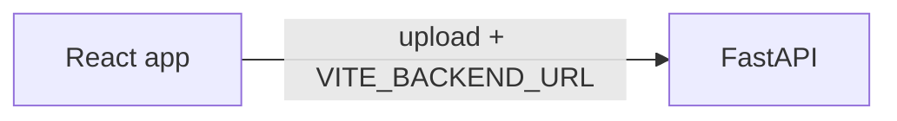

# MultiLingo (Vista)

**English audio/video → Hindi, Kannada, Tamil, Telugu** via a React (Vite) frontend and a FastAPI backend.  
The **website is translation-only** — no feed, login, or social features in the UI.

**Stack:** React (Vite) · FastAPI · deploy: **Vercel** (frontend) + **Render** (or any host for the API).

---

## Contents

- [Architecture](#architecture)
- [Repository layout](#repository-layout)
- [Local development](#local-development)
- [Environment variables](#environment-variables)
- [Production deploy](#production-deploy)
- [Backend API (translation)](#backend-api-translation)
- [Further reading](#further-reading)

---

## Architecture



| Piece | Responsibility |
|--------|----------------|
| **React** | Single flow: upload, pick language, poll status, download. Uses **`VITE_BACKEND_URL`** only. |
| **FastAPI** | MultiLingo pipeline (Whisper → translate → TTS; optional video). See `backend/app/multilingo/`. |

The backend repo may still include optional `/auth` and `/posts` routes (Supabase); the **frontend does not use them**.

---

## Repository layout

| Path | Description |
|------|-------------|
| `frontend/` | Vite + React — MultiLingo UI only |
| `frontend/src/pages/Multilingo.jsx` | Main screen |
| `frontend/src/api/multilingoApi.js` | Calls to `/process`, `/status`, `/download` |
| `frontend/src/config/appConfig.js` | `getBackendBaseUrl()` / `requireBackendBaseUrl()` |
| `backend/` | FastAPI (`uvicorn app.main:app`) |
| `package.json` (repo root) | Convenience scripts: `npm run dev:frontend`, `npm run dev:backend` |
| `backend/static/multilingo/` | Optional static UI at `/ml` on the API host |

**Pipeline:** Whisper → translate (`deep-translator`) → gTTS → optional video (MoviePy). Heavy deps (PyTorch, FFmpeg); small instances may not be enough.

---

## Local development

**Requirements:** Node.js, Python 3.10+.

From the **repo root**:

```bash
npm run dev:frontend    # Vite on :5173
npm run dev:backend     # FastAPI on :8000 (needs venv + pip install in backend/)
```

Or manually:

```bash
cd backend
python -m venv .venv
# Windows: .venv\Scripts\activate
pip install -r requirements.txt
uvicorn app.main:app --reload --host 127.0.0.1 --port 8000
```

```bash
cd frontend
cp .env.example .env   # set VITE_BACKEND_URL=http://127.0.0.1:8000
npm install
npm run dev
```

Open **http://127.0.0.1:5173**. API docs: **http://127.0.0.1:8000/docs**

---

## Environment variables

Copy [`frontend/.env.example`](frontend/.env.example). Never commit real secrets.

### Frontend (`frontend/.env`)

| Variable | Purpose |
|----------|---------|
| `VITE_BACKEND_URL` | FastAPI origin **without** trailing slash (e.g. `http://127.0.0.1:8000` or your Render URL) |

No Supabase or other client env vars are required for the translation UI.

### Backend (`backend/.env`)

For **CORS** with the Vite dev server or Vercel, set at least:

| Variable | Purpose |
|----------|---------|
| `CORS_ORIGINS` | Comma-separated origins, e.g. `http://127.0.0.1:5173,https://your-app.vercel.app` |

Optional Supabase variables (`SUPABASE_URL`, `SUPABASE_SERVICE_ROLE_KEY`, `SUPABASE_JWT_SECRET`) are only needed if you use server routes that validate JWTs (`/auth/*`, `/posts/*`). MultiLingo **`/process`** does not require them.

Optional: `DEBUG=1` to log config on startup (avoid in production with sensitive logs).

---

## Production deploy

1. **Backend:** host FastAPI (e.g. Render) with `pip install -r requirements.txt`, start `uvicorn app.main:app --host 0.0.0.0 --port $PORT`, set **`CORS_ORIGINS`** to your Vercel URL(s).
2. **Frontend (Vercel):** Root `frontend`, build `npm run build`, output `dist`, env **`VITE_BACKEND_URL`** = your API HTTPS base URL (no trailing slash).

[`frontend/vercel.json`](frontend/vercel.json) keeps SPA routes working on refresh.

---

## Backend API (translation)

| Method | Path | Notes |
|--------|------|--------|
| POST | `/process` | Upload file + `target_language` |
| GET | `/status/{job_id}` | Processing status |
| GET | `/download/{job_id}` | Download result when ready |

Full reference when running locally: `/docs`.

---

## Further reading

- [`supabase/README.md`](supabase/README.md) — only if you use optional Supabase-backed routes  
- [FastAPI docs](https://fastapi.tiangolo.com/)

---

## License

Add a `LICENSE` file if you distribute the project.
