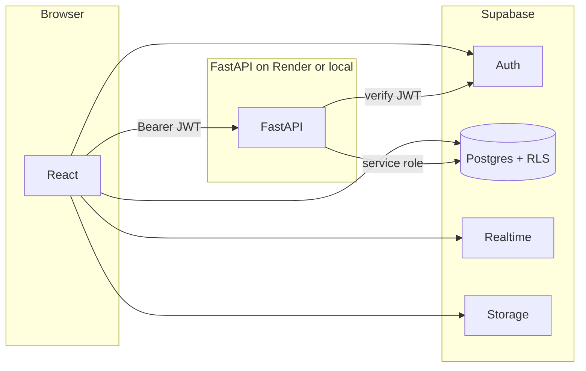

# Vista

Social feed app with profiles, posts, follows, likes, comments, DMs, and optional **MultiLingo** (English → Indian languages).  
**Stack:** React (Vite) · FastAPI · Supabase (Postgres, Auth, Storage, Realtime) · deploy: **Vercel** + **Render** + Supabase.

---

## Contents

- [Architecture](#architecture)
- [Repository layout](#repository-layout)
- [Local development](#local-development)
- [Environment variables](#environment-variables)
- [Authentication URLs (Supabase)](#authentication-urls-supabase)
- [Production deploy](#production-deploy)
- [Backend API](#backend-api)
- [Security](#security)
- [Further reading](#further-reading)

---

## Architecture



| Piece | Responsibility |
|--------|------------------|
| **React** | Supabase **anon** key for most data (RLS). Routes include `/home`, `/translate` (MultiLingo), `/messages`, etc. |
| **Supabase** | Auth, database, storage, realtime; migrations in `supabase/migrations/`. |
| **FastAPI** | Validates Supabase user JWTs; optional routes like `/posts/`, `/process` (MultiLingo). Uses **service role** only on the server. |

Posts in the UI are implemented via **`frontend/src/api/postApi.js`** (direct Supabase). **`frontend/src/api/backendClient.js`** (`fetchWithJwt`) is available for server-backed routes.

---

## Repository layout

| Path | Description |
|------|-------------|
| `frontend/` | Vite + React app |
| `backend/` | FastAPI (`uvicorn app.main:app`) |
| `supabase/` | SQL migrations — run order in [`supabase/README.md`](supabase/README.md) |
| `backend/static/multilingo/` | Optional static MultiLingo UI at `/ml` on the API host |
| `render.yaml` | Render Blueprint (backend) |
| `frontend/vercel.json` | Vercel SPA rewrites |

### MultiLingo (optional)

Pipeline: Whisper → translate (`deep-translator`) → gTTS → optional video (MoviePy). React uses **`/translate`** with `VITE_BACKEND_URL`. Heavy deps (PyTorch, FFmpeg); small Render instances may not be enough.

---

## Local development

**Requirements:** Node.js, Python 3.10+, Supabase project.

```bash
# Backend — from repo root
cd backend
python -m venv .venv
# Windows: .venv\Scripts\activate   |  macOS/Linux: source .venv/bin/activate
pip install -r requirements.txt
uvicorn app.main:app --reload --host 127.0.0.1 --port 8000
```

```bash
# Frontend — second terminal
cd frontend
npm install
npm run dev
```

Open **http://127.0.0.1:5173** (Vite). API docs: **http://127.0.0.1:8000/docs**

---

## Environment variables

Copy examples: [`frontend/.env.example`](frontend/.env.example), [`backend/.env.example`](backend/.env.example). Never commit real secrets.

### Frontend (`frontend/.env`)

| Variable | Purpose |
|----------|---------|
| `VITE_SUPABASE_URL` | Supabase project URL |
| `VITE_SUPABASE_ANON_KEY` | Supabase anon (public) key |
| `VITE_BACKEND_URL` | API origin **without** trailing slash (e.g. `http://127.0.0.1:8000` or your Render URL) |

### Backend (`backend/.env`)

| Variable | Purpose |
|----------|---------|
| `SUPABASE_URL` | Same project URL |
| `SUPABASE_SERVICE_ROLE_KEY` | Service role key — **server only** |
| `SUPABASE_JWT_SECRET` | Dashboard → Project Settings → API → **JWT Secret** |
| `CORS_ORIGINS` | Comma-separated browser origins (defaults to local Vite if omitted) |

Optional: `DEBUG=1` to log config on startup (avoid in production with sensitive logs).

---

## Authentication URLs (Supabase)

In **Authentication → URL Configuration**:

- **Site URL:** your deployed app (e.g. `https://your-app.vercel.app`).
- **Redirect URLs:** include local dev, production, previews, and password reset, for example:  
  `http://127.0.0.1:5173/**` · `https://your-app.vercel.app/**` · `https://your-app.vercel.app/update-password`

Enable **Google** under **Providers** if you use “Continue with Google” (OAuth client from Google Cloud). Details: [`supabase/README.md`](supabase/README.md).

---

## Production deploy

Typical setup: **Supabase** (data + auth) · **Render** (FastAPI) · **Vercel** (static frontend + env-injected `VITE_*`).

### Supabase

1. Apply migrations ([`supabase/README.md`](supabase/README.md)).
2. Copy API URL, anon key, service role key, JWT secret into Render/Vercel as above.
3. Configure **Site URL** and **Redirect URLs** for your Vercel domain(s).

### Render (backend)

1. New **Web Service** → repo, **Root Directory:** `backend`.
2. **Build:** `pip install -r requirements.txt`  
3. **Start:** `uvicorn app.main:app --host 0.0.0.0 --port $PORT`
4. Set `SUPABASE_*`, `SUPABASE_JWT_SECRET`, and **`CORS_ORIGINS`** including every frontend origin you use (`https://your-app.vercel.app`, preview URLs, optional localhost).

Use the service **HTTPS URL** as `VITE_BACKEND_URL` on Vercel (no trailing slash).

### Vercel (frontend)

1. **Root Directory:** `frontend`
2. **Build:** `npm run build` · **Output:** `dist`
3. Env: `VITE_SUPABASE_URL`, `VITE_SUPABASE_ANON_KEY`, `VITE_BACKEND_URL` = Render URL.

Redeploy after changing env vars. [`frontend/vercel.json`](frontend/vercel.json) keeps SPA routes working on refresh.

### Deploy checklist

- [ ] Migrations applied on Supabase  
- [ ] Auth redirect URLs cover Vercel + localhost  
- [ ] Render env set; `CORS_ORIGINS` matches Vercel origins  
- [ ] Vercel `VITE_BACKEND_URL` = Render base URL  
- [ ] MultiLingo: only if the Render plan can handle ML + FFmpeg  

---

## Backend API

| Method | Path | Auth | Notes |
|--------|------|------|--------|
| GET | `/auth/me` | Bearer JWT | Debug claims |
| GET/POST | `/posts/` | Bearer JWT | Server-side posts (optional vs direct Supabase) |
| POST | `/process` | — | MultiLingo upload (see `backend/app/multilingo/`) |

Full reference when running locally: `/docs`.

---

## Security

- Do **not** expose the Supabase **service role** key or JWT secret in the client or public repos.
- Keep **`CORS_ORIGINS`** limited to real frontends (Vercel + dev).
- Rotate keys if leaked; use separate Supabase projects for staging/production when possible.

---

## Further reading

- [`supabase/README.md`](supabase/README.md) — migration order, OAuth, RLS notes  
- [Supabase Auth](https://supabase.com/docs/guides/auth) · [RLS](https://supabase.com/docs/guides/auth/row-level-security) · [Realtime](https://supabase.com/docs/guides/realtime)

---

## License

Add a `LICENSE` file if you distribute the project.
