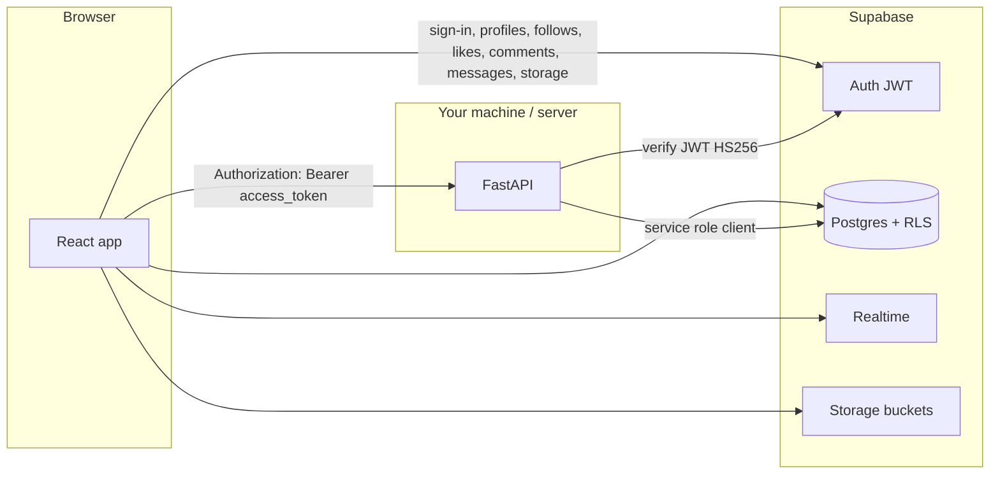

# Vista

Vista is a full-stack social-style web app: **React (Vite)** on the client, **Supabase** for authentication, database, storage, realtime messaging, and Row Level Security (RLS), plus a **FastAPI** backend that performs privileged operations (notably **posts via the service role**) while still tying actions to the logged-in user using their **Supabase access token (JWT)**.

---

## How it fits together



| Layer | Role |
|--------|------|
| **Frontend** | Uses `@supabase/supabase-js` with the **anon key** for auth and most data (subject to RLS). **Posts in the UI** are loaded and created via **`frontend/src/api/postApi.js`** (direct Supabase). |
| **Supabase Auth** | Issues the user **access_token** (JWT). The backend validates it with **`SUPABASE_JWT_SECRET`** (same secret as in Supabase → Project Settings → API). |
| **FastAPI** | Optional parallel path: uses **`SUPABASE_SERVICE_ROLE_KEY`** to access `posts` with full privileges, while **`user_id` is taken from the JWT `sub`**. Handy for server-side rules or if you later move post writes off the anon client. The bundled React app does **not** call these routes yet—see **`frontend/src/api/backendClient.js`** (`fetchWithJwt`) to wire them. |
| **SQL / RLS** | Migrations under `supabase/migrations/` define tables, triggers, policies, and optional realtime for chat. See [`supabase/README.md`](supabase/README.md) for the recommended apply order. |

---

## Repository layout

| Path | Purpose |
|------|---------|
| `frontend/` | Vite + React 19, routing, UI pages; **MultiLingo** at **`/translate`** (calls FastAPI `/process`). |
| `backend/` | FastAPI app: `GET /auth/me`, `GET/POST /posts/`, JWT middleware. |
| `backend/static/multilingo/` | **MultiLingo AI** static UI (Bootstrap) + `POST /process`, `GET /status/{id}`, `GET /download/...`. |
| `supabase/` | SQL migrations and [`supabase/README.md`](supabase/README.md) (schema, Google OAuth notes). |

### MultiLingo AI (English → Hindi / Kannada / Tamil / Telugu)

The backend includes a **Flask-compatible** pipeline ported to FastAPI: Whisper (English ASR) → Google Translate (`deep-translator`) → gTTS → optional **video** remux (MoviePy), plus HTML/PDF reports.

- **Web UI (same origin as API):** after starting the backend, open **[http://127.0.0.1:8000/ml/](http://127.0.0.1:8000/ml/)** (trailing slash). The page uses `API_BASE = window.location.origin` so `/process`, `/status`, `/download` resolve correctly.
- **Your long Bootstrap template:** replace [`backend/static/multilingo/index.html`](backend/static/multilingo/index.html) with your HTML, remove Jinja `` loops (use static `<option>` tags), and at the top of the main `<script>` add `const API_BASE = window.location.origin;`, then prefix every `fetch('/process'…)`, `fetch(\`/status/${id}\`)`, and download URLs with `` `${API_BASE}` ``.
- **Dependencies:** `pip install -r requirements.txt` (includes `openai-whisper`, `moviepy`, `gtts`, `deep-translator`, `reportlab`, etc.). **FFmpeg** must be installed on the system PATH for MoviePy video encoding.
- **Uploads / outputs:** `backend/static/uploads/` and `backend/static/outputs/` (created at runtime).

---

## Prerequisites

- **Node.js** (for the frontend)
- **Python 3.10+** (for the backend)
- A **Supabase** project (free tier is fine for development)

---

## Configuration

### 1. Supabase project

Create a project, then run the SQL migrations in the order described in **[`supabase/README.md`](supabase/README.md)** (SQL Editor or Supabase CLI).

### 2. Frontend — `frontend/.env`

Create `frontend/.env` (do not commit real keys):

```env
VITE_SUPABASE_URL=https://YOUR_PROJECT.supabase.co
VITE_SUPABASE_ANON_KEY=your_anon_publishable_key
VITE_BACKEND_URL=http://127.0.0.1:8000
```

- **`VITE_BACKEND_URL`**: origin of the FastAPI server **without** a trailing path (the client builds paths like `/posts/`).

### 3. Backend — `backend/.env`

Create `backend/.env`:

```env
SUPABASE_URL=https://YOUR_PROJECT.supabase.co
SUPABASE_SERVICE_ROLE_KEY=your_service_role_key
SUPABASE_JWT_SECRET=your_jwt_secret
```

- **`SUPABASE_SERVICE_ROLE_KEY`**: from **Project Settings → API** (service role — **keep server-only**; never expose in the browser).
- **`SUPABASE_JWT_SECRET`**: from **Project Settings → API → JWT Secret** (used to verify `Authorization: Bearer <access_token>`).

Google sign-in and redirect URLs are documented in [`supabase/README.md`](supabase/README.md).

---

## Run locally

**Terminal 1 — backend**

```bash
cd backend
python -m venv .venv
# Windows: .venv\Scripts\activate
# macOS/Linux: source .venv/bin/activate
pip install -r requirements.txt
uvicorn app.main:app --reload --host 127.0.0.1 --port 8000
```

**Terminal 2 — frontend**

```bash
cd frontend
npm install
npm run dev
```

Open the URL Vite prints (default **http://127.0.0.1:5173**). The app expects the backend at **`VITE_BACKEND_URL`** for JWT-backed routes.

---

## Backend API (summary)

| Method & path | Auth | Description |
|---------------|------|-------------|
| `GET /auth/me` | Bearer JWT | Returns JWT claims (debugging / verifying the token pipeline). |
| `POST /posts/` | Bearer JWT | Creates a post; `user_id` is derived from the token, body is `content` and/or `image_url`. |
| `GET /posts/` | Bearer JWT | Lists posts (service-role query on the server). |

Protected routes use **`HTTPBearer`**: send `Authorization: Bearer <supabase_access_token>`. To call them from React, use **`frontend/src/api/backendClient.js`** → `fetchWithJwt(...)` (reads the Supabase session and sets the header). Today the UI uses Supabase directly for posts; `fetchWithJwt` is ready for `/auth/me`, `/posts/`, or future routes.

Interactive docs: **http://127.0.0.1:8000/docs** (when the server is running).

---

## Frontend behavior (high level)

- **Auth**: `AuthContext` subscribes to `supabase.auth.onAuthStateChange`, persists session in `localStorage`, and manages token refresh (with visibility-based pause/resume).
- **Routing** (`App.jsx`): unauthenticated users go to login/signup; users without a **profile name** are sent to complete **Profile** before **Home**.
- **Data**: Social features (including **posts** via `postApi.js`) go **directly to Supabase** with the anon client under RLS. The FastAPI post endpoints are an alternate design you can adopt by switching `postApi.js` to `fetchWithJwt("/posts/...")` if you want all post IO on the server.

---

## Security notes

- **Never** put the service role key in the frontend or in public repos.
- CORS is currently permissive (`allow_origins=["*"]` in `backend/app/main.py`) — tighten this for production (specific origins only).
- For production, rotate keys if they leak and prefer environment-specific Supabase projects.

---

## What you could use instead (alternatives)

These are common swaps; pick based on hosting, team skills, and how much you want “managed auth + DB” vs rolling your own.

### Instead of FastAPI as the “BFF” for posts

| Alternative | When it helps |
|-------------|----------------|
| **Supabase client only (anon key + RLS)** | Simplest: define RLS on `posts` so users can insert/select only their rows (or public feed rules). No Python server. |
| **Supabase Edge Functions** | Server-side logic at the edge (Deno), still close to Supabase; good for webhooks, validation, or hiding secrets. |
| **Next.js / Remix API routes** | If you move to a full-stack JS framework and want colocated API handlers. |
| **tRPC / GraphQL layer** | Strong typing or flexible querying over your own server. |

### Instead of Supabase entirely

| Alternative | Tradeoff |
|-------------|----------|
| **Firebase (Auth + Firestore + Storage)** | Google ecosystem; different query/RLS model (security rules instead of SQL RLS). |
| **Appwrite / PocketBase** | Self-hostable BaaS; smaller ecosystem than Supabase/Firebase. |
| **Postgres + Auth provider (Clerk, Auth0, Cognito) + your API** | Maximum control; you own migrations, auth integration, and hosting. |
| **MongoDB Atlas + Atlas App Services** | Document model; different from relational + RLS patterns used here. |

### Instead of validating JWTs with a shared secret in FastAPI

Supabase’s default user JWTs use **HS256** with the project **JWT secret** (what this repo uses). Alternatives if you redesign auth:

- **JWKS / asymmetric keys** (some providers issue RS256 tokens verified with public keys).
- **Framework-specific middleware** (e.g. official or community “Supabase + FastAPI” helpers) — same underlying idea: validate the access token and read `sub`.

### Instead of React + Vite

- **Next.js** (SSR/SSG, API routes), **Remix**, **SvelteKit**, or **Vue (Nuxt)** — same backends (Supabase/FastAPI) usually work; you mainly change how env vars and routing are handled.

---

## Further reading

- **[`supabase/README.md`](supabase/README.md)** — migration order, Google OAuth, what lives in Postgres vs the FastAPI path.
- **Supabase docs**: [Auth](https://supabase.com/docs/guides/auth), [RLS](https://supabase.com/docs/guides/auth/row-level-security), [Realtime](https://supabase.com/docs/guides/realtime).

---

## License

Add a `LICENSE` file if you plan to open-source or distribute the project.
